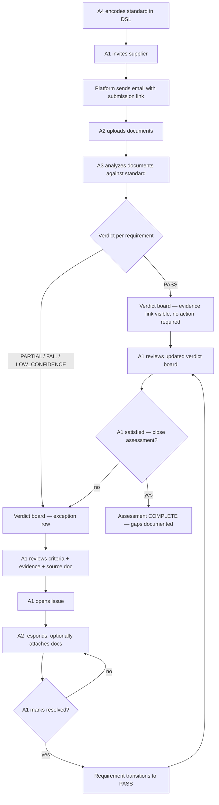

## Summary

The Nestlé pilot (September 30) delivers compliance assessment through document upload and AI verdict generation, with a verdict board and issue log as the specialist's only required interface. The data model is structured from the start as a wallet-stub — shaped to accept the full zero-submission pull and W3C VC 2.0 cryptographic layer when those ship post-pilot.

---

## Problem Frame

Compliance specialists at CPG companies spend most of their time reviewing evidence rather than decisions. The north-star architecture fixes this by pulling evidence continuously from supplier source systems and surfacing only verdicts; specialists see exceptions, not documents. For the Nestlé pilot, that pull is not possible — suppliers hold paper records and spreadsheets, not addressable APIs. The pilot delivers the exception-only specialist experience on top of document upload, and establishes the data model shape so the zero-submission pull can be added without structural rework.

---

## Key Decisions

- **Specialist-first.** The supplier submission surface is minimal: email link and document upload only. Suppliers do not see requirement criteria or verdicts at any point. The specialist's experience is the design center for the pilot.

- **Wallet-stub data model from day one.** The compliance record is structured as one record per supplier–standard pair, with per-requirement evidence items and verdicts. The shape accommodates W3C VC 2.0 portability; the cryptographic layer is not implemented in the pilot.

- **Exception-only review.** The specialist sees verdicts per requirement, not raw evidence. Non-passing verdicts surface AI-extracted evidence excerpts, requirement criteria, and a source document link. The source document is an escape hatch, not the primary review path.

- **Specialist-initiated assessment closure.** An assessment is complete when the specialist explicitly closes it, not when all requirements automatically reach PASS. Laura's goal is understanding and documenting supplier gaps — not gating closure on 100% pass. Non-PASS requirements at closure are preserved as documented gaps. Assessment is a snapshot; a new assessment can be initiated for the same supplier in a subsequent cycle.

- **Issue log drives individual verdict resolution, not assessment closure.** When a specialist marks an issue resolved, the linked requirement transitions to PASS. This does not auto-complete the assessment. The specialist reviews the full verdict board and closes the assessment independently when satisfied.

- **PARTIAL as a distinct verdict.** A PARTIAL verdict means the supplier's evidence satisfies some but not all conditions of a multi-condition requirement. PARTIAL behaves like FAIL in the workflow: the specialist can open an issue to request the missing evidence.

- **Proof links for all verdicts.** Every verdict — PASS, PARTIAL, FAIL, and LOW_CONFIDENCE — carries AI-extracted evidence excerpts linked to source document and location. This allows Laura to audit why the AI returned PASS, not just why it flagged a failure.

- **Issue log as parallel entities.** The compliance service builds its own Issue and Comment entities rather than reusing the interventions service's equivalents. The interventions schema couples Comment to `monitoringPeriodId` and `componentId`, making direct reuse impractical. The compliance entities follow the same field shape and patterns.

- **AWS Bedrock for AI processing.** The AI assessment pipeline uses Claude via AWS Bedrock rather than the direct Anthropic API, to stay within AWS IAM boundaries. *Pending confirmation from Royce and Chris.*

- **Issue log, not certification report.** The output of a completed assessment is a closed record — requirements at their current verdict states — reached through the specialist's review and explicit close action. The platform does not generate a formal certification document.

- **Athian-encoded standard.** Athian encodes Nestlé's Responsible Sourcing Core Values in the compliance DSL before the pilot. Self-serve standard onboarding is deferred.

---

## Actors

A1. **Compliance Specialist** — internal reviewer at the CPG buyer (Nestlé for the pilot). Reviews the verdict board, opens issues on non-passing requirements, marks issues resolved.

A2. **Supplier** — receives an invitation email, uploads documents to the submission portal, responds to issue comments.

A3. **AI Assessment System** — analyzes uploaded documents against the DSL-encoded standard, produces per-requirement verdicts, extracts evidence excerpts.

A4. **Athian Team** — encodes Nestlé's Responsible Sourcing Core Values in the compliance DSL before pilot launch.

---

## Key Flows

- F1. **Standard encoding**
  - **Actors:** A4
  - **Trigger:** Pilot preparation, before any supplier assessment begins
  - **Steps:** Athian team receives Nestlé's Responsible Sourcing Core Values document; encodes each requirement with criteria text, accepted evidence source types, and passing conditions; standard is published to the platform.

- F2. **Supplier invitation and submission**
  - **Actors:** A1, A2
  - **Trigger:** Specialist initiates an assessment for a supplier against the Nestlé standard
  - **Steps:** Platform sends supplier an email with a unique submission link; supplier opens the submission page and uploads documents; upload completes.

- F3. **AI assessment**
  - **Actors:** A3
  - **Trigger:** Supplier upload completes
  - **Steps:** Platform runs AI analysis against the DSL-encoded standard; produces one verdict per requirement (PASS, FAIL, PARTIAL, or LOW_CONFIDENCE); for every verdict, extracts evidence excerpts and links each to its source document and location within that document; verdicts populate the specialist's verdict board.

- F4. **Exception review**
  - **Actors:** A1
  - **Trigger:** Verdict board populated with one or more FAIL, PARTIAL, or LOW_CONFIDENCE verdicts
  - **Steps:** Specialist reviews verdict board; PASS rows surface evidence links but require no action; for non-PASS rows, specialist expands to see requirement criteria, AI-extracted evidence excerpts, and source document link; specialist opens an issue or proceeds to assessment closure.

- F5. **Issue resolution**
  - **Actors:** A1, A2
  - **Trigger:** Specialist opens an issue on a non-passing requirement
  - **Steps:** Specialist comments with what evidence or clarification is missing; supplier receives notification and responds, optionally attaching additional documentation; specialist reviews response; cycle continues until specialist is satisfied; specialist marks the issue resolved; requirement transitions to PASS. Resolving an issue does not automatically close the assessment.

- F6. **Assessment closure**
  - **Actors:** A1
  - **Trigger:** Specialist decides the assessment review is complete
  - **Steps:** Specialist clicks "Close Assessment" on the verdict board; assessment transitions to COMPLETE; remaining non-PASS requirements are preserved as documented gaps. Closure does not require all requirements to be at PASS.

---

## Requirements

**Standard Encoding**

- R1. Nestlé's Responsible Sourcing Core Values is encoded in the compliance DSL by Athian before the pilot; the platform does not require a self-serve standard import workflow.
- R2. Each DSL-encoded requirement carries: identifier, criteria text, accepted evidence source types, and passing conditions for AI assessment.

**Supplier Submission**

- R3. When a specialist initiates an assessment for a supplier, the platform sends the supplier an email containing a unique link to the submission page.
- R4. The submission page accepts document upload and does not expose individual requirement criteria or verdict state to the supplier at any point.
- R5. The platform notifies the specialist when supplier upload completes.

**AI Assessment**

- R6. After upload completes, the platform produces one AI verdict per requirement: PASS, FAIL, PARTIAL, or LOW_CONFIDENCE. PARTIAL indicates the supplier's evidence satisfies some but not all conditions of a multi-condition requirement.
- R7. For every verdict — including PASS — the platform records AI-extracted evidence excerpts and links each excerpt to its source document and location within that document.

**Exception Review Interface**

- R8. The specialist's default view is a verdict board: one row per requirement showing identifier, criteria text, and current verdict.
- R9. PASS requirements appear on the verdict board but require no specialist action; their evidence excerpt and source document link are accessible.
- R10. For FAIL, PARTIAL, and LOW_CONFIDENCE requirements, the specialist can expand the row to see requirement criteria, AI-extracted evidence excerpts, and a link to the source document.
- R11. The source document link opens the original uploaded file.

**Issue Log**

- R12. For any non-PASS requirement, the specialist can open an issue: a comment thread visible to both the specialist and the supplier.
- R13. The supplier can reply to an issue comment and attach additional documentation.
- R14. The specialist can mark an issue resolved, which transitions the requirement verdict to PASS.
- R15. An assessment can be marked COMPLETE at any point after the AI pipeline has run (ASSESSED state), regardless of how many requirements are at PASS. Marking an assessment COMPLETE is a specialist-initiated action, not an automatic state transition.
- R16-issue. Non-PASS requirements remaining at closure are preserved in the record as documented gaps.

**Assessment Closure**

- R17. The verdict board exposes a "Close Assessment" action available to the specialist when the assessment is in ASSESSED state. Triggering it transitions the assessment to COMPLETE.

**Data Model**

- R18. The compliance record data model is structured as a wallet-stub: one record per supplier–standard pair, containing per-requirement evidence items and verdicts, shaped to accept the W3C VC 2.0 cryptographic layer without structural rework.

---

## Acceptance Examples

- AE1. **All requirements pass on initial AI assessment; specialist closes**
  - **Covers:** R6, R7, R8, R9, R15, R17
  - **Given:** Supplier uploads documents; AI assessment completes
  - **When:** All requirements return PASS
  - **Then:** Verdict board shows all PASS rows; each row surfaces an evidence excerpt and source document link; no issues are opened; specialist reviews and clicks "Close Assessment"; assessment transitions to COMPLETE

- AE2. **One requirement returns PARTIAL**
  - **Covers:** R6, R7, R10, R12
  - **Given:** AI returns PARTIAL for one multi-condition requirement (supplier's documents satisfy 2 of 3 conditions)
  - **When:** Specialist expands the PARTIAL row on the verdict board
  - **Then:** Specialist sees criteria text, AI-extracted evidence excerpts with source links, and which conditions the evidence covered; specialist opens an issue to request the missing evidence

- AE3. **Supplier resolves an issue through additional documentation**
  - **Covers:** R13, R14
  - **Given:** Specialist has opened an issue on a LOW_CONFIDENCE or FAIL requirement
  - **When:** Supplier replies with a comment and attaches a new document
  - **Then:** Specialist reviews; marks the issue resolved; requirement transitions to PASS; verdict board updates; assessment remains in ASSESSED state until specialist explicitly closes it

- AE4. **Issue requires multiple rounds**
  - **Covers:** R12, R13, R14
  - **Given:** Specialist has opened an issue on a FAIL requirement
  - **When:** Supplier's initial response does not fully satisfy the requirement criteria
  - **Then:** Specialist replies with a follow-up comment; supplier responds again; cycle continues until specialist marks resolved

- AE5. **Specialist closes assessment with documented gaps**
  - **Covers:** R15, R17, R16-issue
  - **Given:** Assessment has been in ASSESSED state; specialist has worked through priority items but two FAIL requirements remain because the supplier lacks the necessary documentation
  - **When:** Specialist clicks "Close Assessment"
  - **Then:** Assessment transitions to COMPLETE; the two FAIL requirements are preserved in the assessment record as documented gaps; specialist can reference this closed record as evidence of where supplier compliance falls short

---

## Scope Boundaries

**Deferred for later (north-star)**

- Zero-submission evidence pull — platform pulls continuously from supplier source systems (herd management software, ERP, certification body APIs) rather than waiting for document upload
- Cryptographic compliance wallet — W3C Verifiable Credentials 2.0 layer on top of the wallet-stub data model
- Multi-buyer wallet sharing — one supplier record verified by multiple CPG buyers without re-submission
- Standard onboarding workflow — self-serve DSL encoding by CPG compliance teams

**Outside this product's identity**

- Certification report generation — Athian Compliance produces a resolved assessment record, not a formal certification document; formal certification is a separate regulatory workflow outside this product's scope

---

## Dependencies / Assumptions

- Nestlé's Responsible Sourcing Core Values document is approved and provided to Athian before DSL encoding begins.
- Athian team capacity is allocated for standard encoding in time for the September 30 pilot.
- The compliance service builds parallel Issue and Comment entities rather than reusing the interventions service's equivalents. The interventions table schema couples Comment to `monitoringPeriodId` and `componentId`; direct reuse would require schema coupling across unrelated domains.
- Suppliers can receive and act on an email-linked submission flow without a prior platform account.
- AWS Bedrock access is provisioned for the compliance service Lambda for Claude model calls. *(Pending confirmation from Royce and Chris.)*

## Risks

- **Supplier submission identity.** The signed-link approach does not confirm that the upload came from the intended recipient — the email and link can be forwarded. This must be validated with Nestlé and the pilot supplier before live invitations go out. If the approach is rejected, scope for the supplier submission surface will need to be revised (reduced to staff-assisted upload or a separate authenticated supplier portal track).
- **Nestlé standard encoding complexity.** The passing conditions for some Nestlé requirements may be ambiguous or require AI prompt tuning to produce reliable PARTIAL vs. FAIL distinctions. Encoding complexity is unknown until the full document is reviewed.
- **Claude API document length.** Uploaded documents may exceed the context window. The AI service needs a chunking or summarization strategy for large files; typical supplier document sizes are not yet known.
- **Multiple assessments for the same supplier.** Assessment is modeled as a snapshot — a second assessment can be initiated for the same supplier in a subsequent cycle. Whether constraints are needed (e.g., one open assessment per supplier-standard pair at a time) is not yet decided and should be resolved before U1 implementation.

---

## Sources / Research

- `STRATEGY.md` — product strategy; July 1 POC to Nestlé and September 30 pilot milestones; primary persona is the internal compliance specialist
- `docs/ideation/2026-06-23-athian-compliance-ideation.html` — ideation artifact; ideas 1 (Zero-Submission Evidence Architecture), 3 (Single-Supplier Many-Buyer Compliance Wallet), and 7 (Exception-Only Review — Verdicts Not Evidence)
- EcoVadis — "assess once, unlock everywhere" (3M suppliers); validates the wallet network proposition for the north-star
- Vanta / Drata — continuous API-pull model (300+ integrations, 400+ automated checks per hour); north-star evidence pull prior art
- W3C Verifiable Credentials 2.0 (2025) + UN Transparency Protocol (UNTP) — cryptographic attestation infrastructure for the north-star wallet layer
- Issue log entity shapes: `services/interventions/intervention-service/src/domain/models/comment/comment.ts` and `issue/issue.ts` — field shape reference for the parallel compliance entities (not reused directly)
