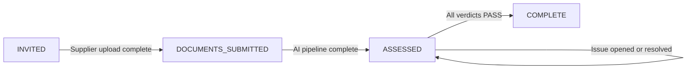

## Summary

Build the Nestlé pilot compliance assessment system as a new `compliance` microservice in the platform monorepo plus corresponding UI in sustainability-platform. Suppliers receive a signed-link invitation, upload documents, and the AI pipeline generates per-requirement verdicts; specialists work from an exception-only verdict board and resolve non-passing requirements through an issue log until all reach PASS. The data model is wallet-stub shaped from the start.

---

## Problem Frame

Compliance specialists spend most of their working time on evidence assembly rather than compliance judgment. The platform's north-star eliminates submission entirely by pulling evidence continuously from supplier source systems; this pilot delivers the exception-only specialist experience on top of document upload, validating the verdict board and issue log workflow with Nestlé ahead of the September 30 delivery. The wallet-stub data model ensures the zero-submission pull and W3C VC 2.0 cryptographic layer can be added without structural rework post-pilot.

(See origin: `docs/brainstorms/2026-06-23-zero-submission-wallet-requirements.md`)

---

## Requirements

Traced from the origin requirements document:

**Standard encoding**
- R1–R2: Nestlé's Responsible Sourcing Core Values is encoded in the compliance DSL by Athian. Each requirement carries identifier, criteria text, accepted evidence source types, and passing conditions.

**Supplier submission**
- R3–R5: Specialist creates an assessment; platform sends supplier an email with a unique signed link; submission page accepts document upload with no requirement or verdict visibility for the supplier; platform notifies specialist on upload completion.

**AI assessment**
- R6–R7: Platform produces one verdict per requirement (PASS/FAIL/LOW_CONFIDENCE) after upload; non-PASS verdicts carry AI-extracted evidence excerpts with source document and location references.

**Exception review**
- R8–R11: Specialist's default view is a verdict board (requirement identifier, criteria text, current verdict). PASS rows require no action. FAIL/LOW_CONFIDENCE rows expand to show criteria, evidence excerpts, and a link to the source document.

**Issue log**
- R12–R15: Specialist opens an issue on any non-PASS requirement; supplier can reply and attach documents; specialist marks the issue resolved, transitioning the requirement to PASS; assessment is complete when all requirements reach PASS.

**Data model**
- R16: Wallet-stub: one record per supplier–standard pair, per-requirement evidence items and verdicts, shaped for W3C VC 2.0 extension without structural rework.

---

## Key Technical Decisions

- **New `compliance` microservice.** Compliance assessment is a distinct domain from emissions interventions. Sharing the interventions service would couple two unrelated domain models and make future zero-submission and wallet extensions harder to isolate. The new service follows the existing microservice-sdk patterns (Entity, Repository, UoW, TypeBox contracts in a `-contracts` package). (See origin)

- **Signed-token supplier auth.** The email invitation link carries a time-limited signed token (HMAC-SHA256 over `assessmentId + expiry`). The supplier submission page validates the token without requiring an existing platform account. No supplier account creation is required for the pilot. A dedicated Lambda authorizer or query-parameter token check handles uploads on the submission route.

- **Claude API for AI document analysis.** Athian already uses Claude in non-platform contexts (Feedback Hub). The compliance service calls the Claude API directly from a Lambda triggered by EventBridge. AWS Bedrock is the alternative if IAM-boundary isolation becomes a requirement post-pilot — the application logic is identical either way.

- **Assessment lifecycle as DynamoDB enum attribute.** Assessment state (`INVITED → DOCUMENTS_SUBMITTED → ASSESSED → COMPLETE`) lives as a string enum on the ComplianceAssessment entity, not in a separate state table. DynamoDB conditional writes guard state transitions against races.

- **Issue log as new ComplianceIssue + ComplianceComment entities.** The existing interventions Comment and Issue models are structurally sound but tightly coupled to the interventions DynamoDB table via `monitoringPeriodId` and `componentId` fields. The compliance service introduces parallel entities in its own table, following the same field shape and repo conventions. This avoids schema coupling while preserving design consistency.

- **Verdict-to-PASS on issue resolution.** When a specialist marks an issue resolved, the linked ComplianceVerdict transitions to PASS. The resolve-issue use case then checks whether all requirements for the assessment are PASS and, if so, transitions the assessment to COMPLETE. This logic lives in the use case layer, not in the AI pipeline.

---

## High-Level Technical Design

**Assessment lifecycle:**



**Multi-service sequence for a full assessment cycle:**

```mermaid
sequenceDiagram
  participant Spec as Specialist
  participant CS as Compliance Service
  participant Mail as Mailer Service
  participant Sup as Supplier
  participant AI as AI Pipeline

  Spec->>CS: Create assessment (standardId, supplierId)
  CS->>Mail: SendEmailEvent (signed token URL)
  Mail->>Sup: Invitation email
  Sup->>CS: Upload documents (presigned S3 URL)
  CS->>CS: Emit COMPLIANCE_DOCUMENTS_SUBMITTED
  CS->>AI: EventBridge trigger
  AI->>CS: Persist verdicts + evidence excerpts
  CS->>CS: Assessment → ASSESSED
  Spec->>CS: Fetch verdict board
  Spec->>CS: Create issue (non-PASS requirement)
  CS->>Sup: Issue notification email
  Sup->>CS: Add comment + optional attachment
  Spec->>CS: Resolve issue
  CS->>CS: Verdict → PASS; all PASS → COMPLETE
```

---

## Output Structure

**Backend — new service:**

```
services/compliance/
├── compliance-contracts/
│   └── src/
│       ├── assessment/         # assessment, verdict, standard DTO + schema files
│       └── issue/              # issue, comment DTO + schema files
└── compliance-service/
    └── src/
        ├── domain/
        │   ├── models/         # ComplianceAssessment, ComplianceVerdict, ComplianceStandard,
        │   │                   #   ComplianceIssue, ComplianceComment
        │   ├── repos/          # repo interfaces + DynamoDB adapters
        │   ├── usecases/       # create-assessment, upload-document, process-assessment,
        │   │                   #   create-issue, add-comment, resolve-issue
        │   └── services/       # ai-assessment.service.ts
        ├── dynamodb/
        │   └── entities/       # ElectroDB entity definitions
        ├── lambda/
        │   └── handlers/       # HTTP + EventBridge Lambda handlers
        ├── constructs/         # CDK stack construct
        └── seed/               # Nestlé standard seed data
```

**Frontend — new route trees:**

```
libs/app/web-app/src/app/
├── verifier/compliance/
│   ├── page.tsx                # assessment list
│   ├── [assessmentId]/
│   │   ├── page.tsx            # verdict board
│   │   └── components/
│   │       ├── VerdictBoard.tsx
│   │       ├── RequirementRow.tsx
│   │       ├── EvidenceDetail.tsx
│   │       └── IssueThread.tsx
│   └── hooks/
│       ├── use-compliance-assessment.ts
│       └── use-compliance-verdicts.ts
└── supplier/compliance/
    └── [token]/
        ├── page.tsx            # supplier submission page (unauthenticated)
        └── components/
            └── DocumentUploadForm.tsx
```

---

## Implementation Units

### U1. Compliance domain models and service standup

**Goal:** Establish the new `compliance` microservice with domain models, DynamoDB table, CDK construct, TypeBox contracts, and the Nestlé standard seed data. All subsequent units depend on this foundation.

**Requirements:** R1, R2, R16

**Dependencies:** None

**Files:**
- `services/compliance/compliance-contracts/src/assessment/assessment.props.ts`
- `services/compliance/compliance-contracts/src/assessment/assessment.dtos.ts`
- `services/compliance/compliance-contracts/src/assessment/assessment.schemas.ts`
- `services/compliance/compliance-contracts/src/issue/issue.props.ts`
- `services/compliance/compliance-contracts/src/issue/issue.dtos.ts`
- `services/compliance/compliance-service/src/domain/models/compliance-assessment.ts`
- `services/compliance/compliance-service/src/domain/models/compliance-verdict.ts`
- `services/compliance/compliance-service/src/domain/models/compliance-standard.ts`
- `services/compliance/compliance-service/src/domain/models/compliance-issue.ts`
- `services/compliance/compliance-service/src/domain/models/compliance-comment.ts`
- `services/compliance/compliance-service/src/dynamodb/entities/compliance-assessment.entity.ts`
- `services/compliance/compliance-service/src/dynamodb/entities/compliance-verdict.entity.ts`
- `services/compliance/compliance-service/src/domain/repos/compliance-assessment.repo.ts`
- `services/compliance/compliance-service/src/domain/repos/compliance-verdict.repo.ts`
- `services/compliance/compliance-service/src/constructs/compliance-stack.ts`
- `services/compliance/compliance-service/src/seed/nestle-standard.seed.ts`
- `services/compliance/compliance-service/src/domain/models/compliance-assessment.spec.ts`
- `services/compliance/compliance-service/src/domain/repos/compliance-assessment.repo.spec.ts`

**Approach:**
- Follow the microservice-sdk Entity + UoW pattern. ComplianceAssessment props: `standardId`, `supplierId`, `state: AssessmentState` (enum: INVITED | DOCUMENTS_SUBMITTED | ASSESSED | COMPLETE), `createdAt`. ComplianceVerdict props: `assessmentId`, `requirementId`, `verdict: VerdictType` (PASS | FAIL | LOW_CONFIDENCE), `evidenceExcerpts: EvidenceExcerpt[]` (each: `text`, `sourceDocumentId`, `location`). ComplianceStandard props: `name`, `version`, `requirements: ComplianceRequirement[]` (each: `id`, `criteria`, `acceptedSourceTypes`, `passingCondition`).
- Single DynamoDB table for the compliance service. GSIs: by `supplierId` for supplier-facing lookups; by `assessmentId` for verdict and issue queries. Follow the PK/SK conventions in existing DynamoDB adapters.
- CDK construct: Lambda function set + DynamoDB table, following patterns in `packages/cdk-constructs/`.
- TypeBox schemas for all DTOs following the `*DtoSchema` / `*ModelSchema` naming convention in `-contracts` packages.
- Nestlé standard seed script: encodes Nestlé's Responsible Sourcing Core Values as a ComplianceStandard record with per-requirement entries. One-time data operation, not an admin UI.

**Patterns to follow:**
- `packages/microservice-sdk/src/models/lib/entity.ts` — Entity base class
- `packages/microservice-sdk/src/models/lib/unit-of-work.ts` — UoW pattern
- `services/interventions/interventions-contracts/src/issue/issue.props.ts` — props shape reference
- `services/interventions/intervention-service/src/dynamodb/adapters/comment-table.adapter.ts` — DynamoDB adapter reference

**Test scenarios:**
- ComplianceAssessment creates in `INVITED` state with valid supplierId and standardId
- ComplianceAssessment rejects an invalid state transition (e.g., `ASSESSED → INVITED`)
- ComplianceVerdict creates with `PASS` verdict and empty evidence excerpts
- ComplianceVerdict creates with `FAIL` verdict and non-empty evidence excerpts
- ComplianceVerdict rejects an unrecognized verdict type
- Repository: creates and retrieves assessment by assessmentId; retrieves all verdicts for a given assessmentId
- DynamoDB GSI: retrieves all assessments for a given supplierId

**Verification:** `pnpm build` succeeds for `services/compliance/`. Domain model unit tests pass. Seed script runs and creates the Nestlé standard in a local DynamoDB instance.

---

### U2. Supplier invitation and document upload

**Goal:** Specialist creates an assessment, supplier receives an invitation email with a signed URL, uploads documents, and the assessment transitions to `DOCUMENTS_SUBMITTED`.

**Requirements:** R3, R4, R5

**Dependencies:** U1

**Files:**
- `services/compliance/compliance-service/src/domain/usecases/create-assessment/create-assessment.use-case.ts`
- `services/compliance/compliance-service/src/domain/usecases/create-assessment/create-assessment.use-case.spec.ts`
- `services/compliance/compliance-service/src/domain/usecases/upload-document/upload-document.use-case.ts`
- `services/compliance/compliance-service/src/domain/usecases/upload-document/upload-document.use-case.spec.ts`
- `services/compliance/compliance-service/src/lambda/handlers/create-assessment.handler.ts`
- `services/compliance/compliance-service/src/lambda/handlers/get-upload-url.handler.ts`
- `services/compliance/compliance-service/src/lambda/handlers/submit-documents.handler.ts`
- `libs/app/web-app/src/app/supplier/compliance/[token]/page.tsx`
- `libs/app/web-app/src/app/supplier/compliance/[token]/components/DocumentUploadForm.tsx`

**Approach:**
- `create-assessment` use case: persists ComplianceAssessment in `INVITED` state, generates a signed token (HMAC-SHA256 over `assessmentId + expiry`, 30-day TTL), emits `SendEmailEvent` to the mailer service via EventBridge. Email contains the submission page URL with the token as a query parameter.
- Supplier submission page at `/supplier/compliance/[token]`: unauthenticated route. Token is validated server-side (Next.js route handler): decode, verify HMAC signature, check expiry. No Cognito auth. The page renders a document upload form; it never displays requirement criteria or verdicts (R4).
- `get-upload-url` handler: issues a presigned S3 PUT URL for a given assessmentId (token-validated). Client uploads directly to S3.
- `submit-documents` handler: called after all files are uploaded. Transitions assessment from `INVITED` to `DOCUMENTS_SUBMITTED` using a DynamoDB conditional write. Emits `COMPLIANCE_DOCUMENTS_SUBMITTED` EventBridge event. Notifies specialist (email via mailer) that submission is complete (R5).
- For pilot: assessment creation UI is a minimal form in the verifier area (standardId is fixed to the seeded Nestlé standard; supplierId selected from org contacts).

**Patterns to follow:**
- `services/mailer/mailer-service/src/domain/email-render-service.ts` — email template dispatch
- `services/interventions/intervention-service/src/domain/usecases/` — use case structure
- `libs/app/web-app/src/app/common/components/Documents/InterventionMonitoringPeriodFiles.tsx` — document upload UI pattern (presigned URL flow)

**Test scenarios:**
- `create-assessment`: creates assessment in `INVITED` state; emits `SendEmailEvent` with signed token URL; rejects if the referenced standardId does not exist
- Token validation: valid token grants access to the submission page; expired token returns a user-facing error; tampered token returns an error
- `get-upload-url`: issues presigned URL for an assessment in `INVITED` state; rejects for an assessment in `ASSESSED` or `COMPLETE` state
- `submit-documents`: transitions assessment to `DOCUMENTS_SUBMITTED`; emits `COMPLIANCE_DOCUMENTS_SUBMITTED`; rejects if assessment is already in `ASSESSED` or later state (idempotent guard)
- Supplier page: renders upload UI for a valid token; does not render requirement list or verdict information at any point

**Verification:** End-to-end: specialist creates assessment from the verifier UI; supplier receives an email with a working submission link; supplier uploads at least one document; assessment state is `DOCUMENTS_SUBMITTED` in the database.

---

### U3. AI assessment pipeline

**Goal:** Trigger document analysis after upload, generate per-requirement verdicts (PASS/FAIL/LOW_CONFIDENCE) with evidence excerpts, and transition the assessment to `ASSESSED`.

**Requirements:** R6, R7

**Dependencies:** U1, U2

**Files:**
- `services/compliance/compliance-service/src/lambda/handlers/process-assessment.handler.ts`
- `services/compliance/compliance-service/src/domain/usecases/process-assessment/process-assessment.use-case.ts`
- `services/compliance/compliance-service/src/domain/usecases/process-assessment/process-assessment.use-case.spec.ts`
- `services/compliance/compliance-service/src/domain/services/ai-assessment.service.ts`
- `services/compliance/compliance-service/src/domain/services/ai-assessment.service.spec.ts`

**Approach:**
- `process-assessment` Lambda: triggered by `COMPLIANCE_DOCUMENTS_SUBMITTED` EventBridge event. Fetches assessment, standard requirements, and uploaded documents (S3 presigned GET URLs).
- `ai-assessment.service.ts`: calls the Claude API (Anthropic SDK) with a structured prompt containing each requirement's criteria text and the document content. Claude returns per-requirement: `verdict` (PASS/FAIL/LOW_CONFIDENCE), `reasoning` (used as the evidence excerpt), and `sourceLocation` (document name + approximate page/section). Requirements are processed sequentially to stay within rate limits.
- Persists one ComplianceVerdict per requirement via UoW. Evidence excerpts are stored as `EvidenceExcerpt[]` on the verdict (`{ text, sourceDocumentId, location }`). PASS verdicts store empty `evidenceExcerpts`.
- After all verdicts are persisted, updates assessment state to `ASSESSED` via conditional write.
- Error handling: if the Claude API fails for a single requirement, that verdict is set to `LOW_CONFIDENCE` with reasoning noting the processing error; the pipeline continues for remaining requirements. A hard Lambda crash leaves the assessment in `DOCUMENTS_SUBMITTED`, safe for retry on the next EventBridge delivery attempt.
- Document length: the implementation should chunk or summarize documents that exceed Claude's context window. The precise strategy (fixed-length chunking vs. section-aware splitting) is deferred to implementation once typical document sizes are known.

**Execution note:** Write integration tests covering the full pipeline with a mocked Claude API response rather than live API calls in CI.

**Patterns to follow:**
- `packages/microservice-sdk/src/models/lib/unit-of-work.ts` — transactional verdict persistence
- EventBridge Lambda handler conventions from existing services
- `services/interventions/intervention-service/src/domain/usecases/` — use case structure

**Test scenarios:**
- `process-assessment` triggers on `COMPLIANCE_DOCUMENTS_SUBMITTED` event with a valid assessmentId
- Verdict generation: document content that clearly meets a criterion → `PASS`, no evidence excerpt; content missing a criterion → `FAIL`, evidence excerpt extracted; ambiguous content → `LOW_CONFIDENCE`, evidence excerpt extracted (covers the verdict-type branching from origin)
- All verdicts persisted: assessment transitions to `ASSESSED` after all requirements are processed
- Partial Claude API failure: one requirement returns an API error → `LOW_CONFIDENCE` verdict for that requirement; remaining requirements processed normally; assessment still reaches `ASSESSED`
- Idempotency guard: handler no-ops if assessment is already in `ASSESSED` or `COMPLETE`
- Evidence excerpts: `FAIL` and `LOW_CONFIDENCE` verdicts have non-empty `evidenceExcerpts` with a `sourceDocumentId` reference; `PASS` verdicts have empty excerpts

**Verification:** After a full upload cycle, `GET /assessments/:id/verdicts` returns one verdict per standard requirement with correct verdict types and evidence excerpts. Assessment state is `ASSESSED`.

---

### U4. Verdict board UI

**Goal:** Give the specialist an exception-only view of assessment results — a verdict board with expandable rows for non-PASS requirements showing criteria text, AI-extracted evidence excerpts, and source document link.

**Requirements:** R8, R9, R10, R11

**Dependencies:** U1, U3

**Files:**
- `libs/app/web-app/src/app/verifier/compliance/page.tsx`
- `libs/app/web-app/src/app/verifier/compliance/[assessmentId]/page.tsx`
- `libs/app/web-app/src/app/verifier/compliance/[assessmentId]/components/VerdictBoard.tsx`
- `libs/app/web-app/src/app/verifier/compliance/[assessmentId]/components/RequirementRow.tsx`
- `libs/app/web-app/src/app/verifier/compliance/[assessmentId]/components/EvidenceDetail.tsx`
- `libs/app/web-app/src/app/verifier/compliance/hooks/use-compliance-assessment.ts`
- `libs/app/web-app/src/app/verifier/compliance/hooks/use-compliance-verdicts.ts`
- `libs/app/web-app/src/app/verifier/compliance/[assessmentId]/components/VerdictBoard.spec.tsx`

**Approach:**
- Verdict board: TanStack React Table with one row per requirement. Columns: requirement identifier, criteria text (truncated in collapsed state), verdict badge (PASS green / FAIL red / LOW_CONFIDENCE amber).
- PASS rows: no expand action; verdict badge is the full UI.
- FAIL and LOW_CONFIDENCE rows: row is expandable. The `EvidenceDetail` component renders full criteria text, each AI evidence excerpt (as a block quote or highlighted panel), and a "View source document" link that opens the uploaded file via a presigned S3 GET URL.
- React Query: `use-compliance-assessment` fetches assessment metadata and state; `use-compliance-verdicts` fetches per-requirement verdicts. While assessment is in `DOCUMENTS_SUBMITTED` or processing, display a loading/processing state rather than an empty table.
- Route follows existing verifier persona conventions in `libs/app/web-app/src/app/verifier/`.

**Patterns to follow:**
- `libs/app/web-app/src/app/verifier/components/Assessment/Assessment.tsx` — verdict grid layout
- `libs/web/design-system/src/lib/Table/Table.tsx` — TanStack React Table wrapper
- Status badge styling from existing verifier components

**Test scenarios:**
- Verdict board renders one row per requirement with the correct verdict badge
- PASS row: no expand control is rendered; no evidence detail is accessible
- FAIL row: expand reveals full criteria text, at least one evidence excerpt, and a source document link
- LOW_CONFIDENCE row: expand reveals full criteria text, at least one evidence excerpt, and a source document link
- Source document link: resolves to a presigned S3 URL for the uploaded file
- Assessment in processing state (`DOCUMENTS_SUBMITTED`): board shows a loading/pending indicator, not an empty table
- Summary strip: correct counts of PASS, FAIL, and LOW_CONFIDENCE requirements shown

**Verification:** Specialist can navigate to a completed assessment and see the verdict board. Expanding a FAIL or LOW_CONFIDENCE row shows criteria text, evidence excerpt, and a working document link.

---

### U5. Issue log

**Goal:** Specialist opens issues on non-PASS requirements, specialist and supplier exchange comments until evidence is sufficient, resolving an issue transitions the requirement to PASS, and the assessment reaches COMPLETE when all requirements pass.

**Requirements:** R12, R13, R14, R15

**Dependencies:** U1, U3, U4

**Files:**
- `services/compliance/compliance-service/src/domain/usecases/create-issue/create-issue.use-case.ts`
- `services/compliance/compliance-service/src/domain/usecases/create-issue/create-issue.use-case.spec.ts`
- `services/compliance/compliance-service/src/domain/usecases/add-comment/add-comment.use-case.ts`
- `services/compliance/compliance-service/src/domain/usecases/add-comment/add-comment.use-case.spec.ts`
- `services/compliance/compliance-service/src/domain/usecases/resolve-issue/resolve-issue.use-case.ts`
- `services/compliance/compliance-service/src/domain/usecases/resolve-issue/resolve-issue.use-case.spec.ts`
- `services/compliance/compliance-service/src/lambda/handlers/issue.handler.ts`
- `libs/app/web-app/src/app/verifier/compliance/[assessmentId]/components/IssueThread.tsx`
- `libs/app/web-app/src/app/verifier/compliance/[assessmentId]/components/IssueThread.spec.tsx`

**Approach:**
- ComplianceIssue entity: `assessmentId`, `requirementId`, `state: IssueState` (OPEN | RESOLVED), `openedBy`, `createdAt`. One open issue per requirement per assessment — `create-issue` rejects if an open issue already exists for that `requirementId + assessmentId` pair.
- ComplianceComment entity: `issueId`, `authorId`, `authorRole` (SPECIALIST | SUPPLIER), `message`, `attachedDocumentIds`, `createdAt`. No in-place editing or deletion for pilot simplicity.
- `resolve-issue` use case (atomic UoW): marks issue RESOLVED, updates the linked ComplianceVerdict to PASS, then queries all ComplianceVerdicts for the assessment. If all are PASS, transitions assessment to COMPLETE. These three writes happen in a single UoW commit.
- Supplier attachment: `add-comment` accepts optional `attachedDocumentIds` (S3 keys for documents uploaded via the same presigned URL flow). Attached documents appear as download links in the comment thread.
- Issue thread UI (`IssueThread.tsx`): renders in the expanded row for FAIL/LOW_CONFIDENCE requirements below `EvidenceDetail`. Shows comments in chronological order, add-comment textarea (both specialist and supplier), "Mark Resolved" button (specialist only; hidden for supplier session). Optimistic update on comment submit, following MPComments pattern.
- Supplier notification: emit `SendEmailEvent` to mailer on issue creation (notify supplier) and on specialist comment reply. Email links back to the submission page (token re-validated or new token generated).

**Patterns to follow:**
- `services/interventions/intervention-service/src/domain/models/comment/comment.ts` — Comment entity field shape
- `services/interventions/intervention-service/src/domain/models/issue/issue.ts` — Issue entity field shape
- `libs/app/web-app/src/app/verifier/components/MonitoringPeriod/MPComments.tsx` — comment thread UI (FloatingUI, textarea, optimistic update)
- `packages/microservice-sdk/src/models/lib/unit-of-work.ts` — atomic multi-entity commit

**Test scenarios:**
- `create-issue`: creates an open issue for a FAIL requirement; rejects for a PASS requirement (R12); rejects if an open issue already exists for that requirementId + assessmentId
- `add-comment`: adds comment with correct authorRole; stores `attachedDocumentIds` when provided; rejects comment on a RESOLVED issue
- `resolve-issue`: transitions issue to RESOLVED; updates linked verdict to PASS; checks all verdicts
- Assessment completion — last non-PASS resolved: all verdicts PASS → assessment transitions to COMPLETE (covers origin acceptance case: "supplier resolves issue through additional documentation")
- Assessment not yet complete: one FAIL requirement remains after resolution → assessment stays in `ASSESSED`
- `IssueThread` renders: comments appear in chronological order; "Mark Resolved" button is visible to specialist and absent for supplier; new comment appears optimistically after submit (covers origin acceptance case: "issue requires multiple rounds")
- Supplier attachment: comment with `attachedDocumentIds` renders document download links in the thread

**Verification:** Full flow: specialist opens issue on a FAIL requirement → supplier replies with a comment + attached document → specialist marks issue resolved → requirement shows PASS on verdict board → after all requirements reach PASS, assessment shows COMPLETE.

---

## Scope Boundaries

**Deferred for later (north-star)**
- Zero-submission evidence pull from supplier source systems (herd management software, ERP, certification body APIs)
- W3C Verifiable Credentials 2.0 cryptographic layer on the wallet-stub data model
- Multi-buyer wallet sharing (single supplier record, multiple buyer verifiers)
- Standard onboarding workflow (self-serve DSL encoding for CPG teams)

**Outside this product's identity**
- Certification report generation — assessment output is a resolved record, not a formal certificate

**Deferred to follow-up work**
- Standard admin UI — Athian team encodes the Nestlé standard via seed script for pilot; a management UI is post-pilot scope
- Supplier compliance history and account management
- Assessment audit log (change history)
- Email template customization for invitation and issue notifications

---

## Risks and Dependencies

- **Nestlé standard availability.** The seed script (U1) requires the Nestlé Responsible Sourcing Core Values document to be provided to Athian before development begins. Encoding complexity is unknown until the full document is reviewed — some requirements may have ambiguous criteria that affect AI verdict accuracy.
- **Claude API document length.** Uploaded documents may exceed Claude's context window. The AI service (U3) needs a chunking or section-summarization strategy for large files. The approach is deferred to implementation once typical supplier document sizes are assessed.
- **Existing Issue/Comment DynamoDB coupling.** The interventions Comment table schema uses `monitoringPeriodId` and `componentId` as structural keys. Compliance issues cannot reuse that table directly. This plan creates parallel entities in the compliance service table — correct isolation, but means two similar entity patterns exist in the monorepo. Worth noting in a future consolidation pass.
- **Signed-token supplier auth security posture.** The token-based submission URL bypasses Cognito. Ensure the HMAC implementation, token expiry, and token scope (single-use vs. reusable) are reviewed before sending real supplier invitations to Nestlé.

---

## Sources and Research

- `docs/brainstorms/2026-06-23-zero-submission-wallet-requirements.md` — origin requirements document
- `STRATEGY.md` — product strategy; September 30 pilot milestone; primary persona is the internal compliance specialist
- `packages/microservice-sdk/src/models/lib/` — Entity, UoW, validation base patterns
- `services/interventions/intervention-service/src/domain/models/comment/comment.ts` — Comment entity shape reference
- `services/interventions/intervention-service/src/domain/models/issue/issue.ts` — Issue entity shape reference
- `services/mailer/mailer-service/src/domain/` — email dispatch pattern (SES + EventBridge)
- `libs/app/web-app/src/app/verifier/components/Assessment/Assessment.tsx` — verdict grid pattern
- `libs/app/web-app/src/app/verifier/components/MonitoringPeriod/MPComments.tsx` — comment thread UI pattern
- `libs/app/web-app/src/app/common/components/Documents/InterventionMonitoringPeriodFiles.tsx` — document upload UI pattern
